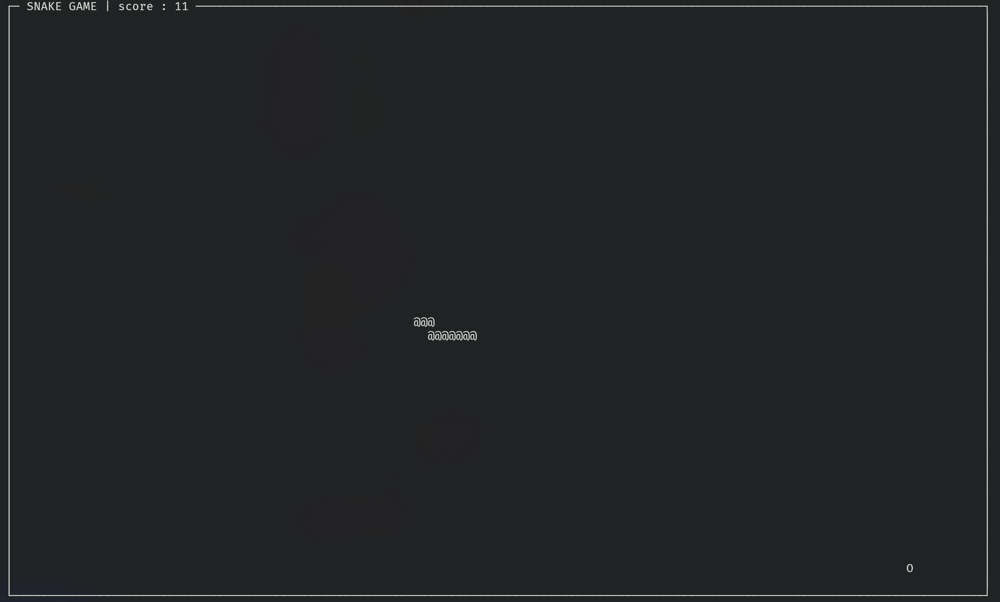

# c_snake

Small C program that utilize the ncurses library the play snake in the terminal.

<p align="center">
    
    <br />
    <i>Screenshot of the game.</i>
</p>

# Build
you can create an executable file using the `makefile` in the project folder and executing this command:

```bash
make
```
Or, you can directly run the program using the command:
```bash
make run
```

# How to play
To move the snake around you can use the `ZQSD` key.

# Licence
- romainflcht